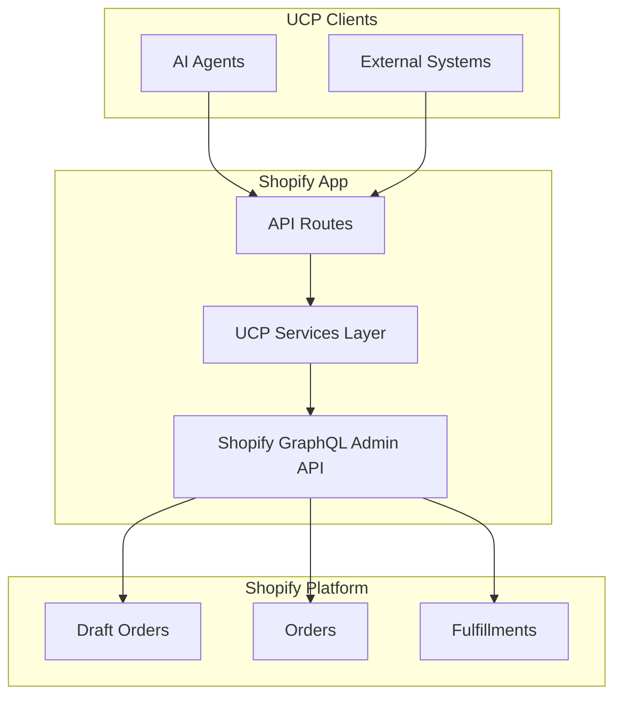

# UCP Shopify Bridge - Walkthrough

## Summary

Successfully created a Shopify embedded app that implements the Universal Commerce Protocol (UCP) as a bridge between Shopify and UCP-compatible platforms.

## Features

- **Cart Capability** (`dev.ucp.shopping.cart`) - Maps to Shopify Draft Orders
- **Checkout Capability** (`dev.ucp.shopping.checkout`) - Full checkout lifecycle management
- **Order Capability** (`dev.ucp.shopping.order`) - Order tracking with fulfillment events
- **Fulfillment Extension** - Shipping options and tracking

## Quick Start

### Prerequisites

- Node.js 20+
- A Shopify Partner account
- A Shopify development store

### Installation

1. **Install dependencies:**
   ```bash
   pnpm install
   ```

2. **Set up the database:**
   ```bash
   pnpm exec prisma generate
   pnpm exec prisma db push
   ```

3. **Copy environment variables:**
   ```bash
   cp .env.example .env
   ```

4. **Configure your app credentials:**
   Edit `.env` with your Shopify app credentials from the Partner Dashboard.

5. **Start the development server:**
   ```bash
   pnpm run dev
   ```

## Creating Your Shopify App

### Step 1: Create Partner Account
1. Go to [partners.shopify.com](https://partners.shopify.com)
2. Click "Join now" and complete registration (free)

### Step 2: Create Development Store
1. In Partner Dashboard, go to **Stores** → **Add store**
2. Select **Development store**
3. Fill in store details and click **Save**

### Step 3: Create the App
1. Go to **Apps** → **Create app**
2. Click **Create app manually**
3. App name: `UCP Bridge`
4. App URL: `https://localhost:3000`

### Step 4: Get Credentials
1. Navigate to **Client credentials**
2. Copy **Client ID** → `SHOPIFY_API_KEY`
3. Copy **Client secret** → `SHOPIFY_API_SECRET`

### Step 5: Configure URLs
1. In **App setup**, set:
   - App URL: `https://localhost:3000`
   - Allowed redirection URLs:
     - `https://localhost:3000/auth/callback`
     - `https://localhost:3000/auth/shopify/callback`

### Step 6: Install in Development Store
1. In the app page, go to **Test your app**
2. Select your development store
3. Click **Install app**

## API Endpoints

### Profile Discovery
```
GET /ucp-profile                      Discover UCP capabilities
```

### Cart API
```
POST   /carts           Create cart
GET    /carts           List carts
GET    /carts/:id       Get cart by ID
PUT    /carts/:id       Update cart
DELETE /carts/:id       Delete cart
```

### Checkout API (UCP Checkout Sessions)
```
POST /checkout-sessions                Create checkout session
GET  /checkout-sessions/:id            Get checkout session
PUT  /checkout-sessions/:id            Update checkout session
POST /checkout-sessions/:id/complete   Complete checkout
POST /checkout-sessions/:id/cancel     Cancel checkout
```

### Order API
```
GET /orders          List orders
GET /orders/:id      Get order by ID
```

## UCP Protocol Mapping

| UCP Entity | Shopify Entity |
|------------|----------------|
| Cart | Draft Order |
| Checkout | Draft Order + Invoice |
| Order | Order |
| Line Item | Line Item |
| Fulfillment | Fulfillment |

## Project Structure

```
shopify-app/
├── app/
│   ├── routes/
│   │   ├── app._index.tsx      # Dashboard
│   │   ├── app.settings.tsx     # Settings page
│   │   ├── api.ucp.cart.ts      # Cart API
│   │   ├── api.ucp.checkout.ts  # Checkout API
│   │   └── api.ucp.order.ts     # Order API
│   ├── services/ucp/
│   │   ├── cartService.ts       # Cart operations
│   │   ├── checkoutService.ts   # Checkout operations
│   │   ├── orderService.ts      # Order operations
│   │   └── types/index.ts       # UCP type definitions
│   ├── shopify.server.ts        # Shopify configuration
│   └── db.server.ts             # Database client
├── prisma/
│   └── schema.prisma            # Database schema
├── shopify.app.toml             # Shopify CLI config
└── package.json
```

## Created Files

### Project Configuration
| File | Purpose |
|------|---------|
| [package.json](file:///Users/j.dorrio.rodriguez/Documents/Proyectos/cosas/UCP/shopify-app/package.json) | Dependencies & scripts |
| [tsconfig.json](file:///Users/j.dorrio.rodriguez/Documents/Proyectos/cosas/UCP/shopify-app/tsconfig.json) | TypeScript config |
| [vite.config.ts](file:///Users/j.dorrio.rodriguez/Documents/Proyectos/cosas/UCP/shopify-app/vite.config.ts) | Vite/Remix config |
| [shopify.app.toml](file:///Users/j.dorrio.rodriguez/Documents/Proyectos/cosas/UCP/shopify-app/shopify.app.toml) | Shopify CLI config (API 2026-01) |
| [prisma/schema.prisma](file:///Users/j.dorrio.rodriguez/Documents/Proyectos/cosas/UCP/shopify-app/prisma/schema.prisma) | Session storage schema |

---

### Core App Files
| File | Purpose |
|------|---------|
| [shopify.server.ts](file:///Users/j.dorrio.rodriguez/Documents/Proyectos/cosas/UCP/shopify-app/app/shopify.server.ts) | Shopify API config, webhooks, auth |
| [db.server.ts](file:///Users/j.dorrio.rodriguez/Documents/Proyectos/cosas/UCP/shopify-app/app/db.server.ts) | Prisma client singleton |
| [root.tsx](file:///Users/j.dorrio.rodriguez/Documents/Proyectos/cosas/UCP/shopify-app/app/root.tsx) | Remix root with Polaris styles |

---

### UCP Services Layer

| File | UCP Capability | Shopify Mapping |
|------|---------------|-----------------|
| [cartService.ts](file:///Users/j.dorrio.rodriguez/Documents/Proyectos/cosas/UCP/shopify-app/app/services/ucp/cartService.ts) | `dev.ucp.shopping.cart` | Draft Orders |
| [checkoutService.ts](file:///Users/j.dorrio.rodriguez/Documents/Proyectos/cosas/UCP/shopify-app/app/services/ucp/checkoutService.ts) | `dev.ucp.shopping.checkout` | Draft Orders + Complete |
| [orderService.ts](file:///Users/j.dorrio.rodriguez/Documents/Proyectos/cosas/UCP/shopify-app/app/services/ucp/orderService.ts) | `dev.ucp.shopping.order` | Orders + Fulfillments |
| [types/index.ts](file:///Users/j.dorrio.rodriguez/Documents/Proyectos/cosas/UCP/shopify-app/app/services/ucp/types/index.ts) | Type definitions | All UCP schemas |

---

### Routes

| Route | Type | Description |
|-------|------|-------------|
| [app._index.tsx](file:///Users/j.dorrio.rodriguez/Documents/Proyectos/cosas/UCP/shopify-app/app/routes/app._index.tsx) | UI | Dashboard with service status |
| [app.settings.tsx](file:///Users/j.dorrio.rodriguez/Documents/Proyectos/cosas/UCP/shopify-app/app/routes/app.settings.tsx) | UI | Settings configuration |
| [api.ucp.cart.ts](file:///Users/j.dorrio.rodriguez/Documents/Proyectos/cosas/UCP/shopify-app/app/routes/api.ucp.cart.ts) | API | Cart CRUD operations |
| [api.ucp.checkout.ts](file:///Users/j.dorrio.rodriguez/Documents/Proyectos/cosas/UCP/shopify-app/app/routes/api.ucp.checkout.ts) | API | Checkout lifecycle |
| [api.ucp.order.ts](file:///Users/j.dorrio.rodriguez/Documents/Proyectos/cosas/UCP/shopify-app/app/routes/api.ucp.order.ts) | API | Order retrieval |

---

## Architecture



---

## API Reference


## Configuration

### API Version
This app uses Shopify API version **2026-01** (LTS).

### Scopes Required
- `read_products`, `write_products`
- `read_orders`, `write_orders`
- `read_draft_orders`, `write_draft_orders`
- `read_fulfillments`, `write_fulfillments`
- `read_inventory`

## License


## Verification

To verify the UCP implementation, use the included script:

```bash
# 1. Start the app and copy the public URL
pnpm dev

# 2. Run the verification script
npx tsx scripts/verify-endpoints.ts --url https://<your-app-url>
```

## Authentication

### UCP Agent Authentication
The app parses the `UCP-Agent` header to identify the calling agent and platform.

Example Header:
`UCP-Agent: MyAI/1.0 (Shopify/2.0; +https://shopify.com/profile)`

### Shopify Authentication
All sensitive endpoints (Creating carts, checkouts) require a valid Shopify session via the Shopify App Bridge authentication flow.
